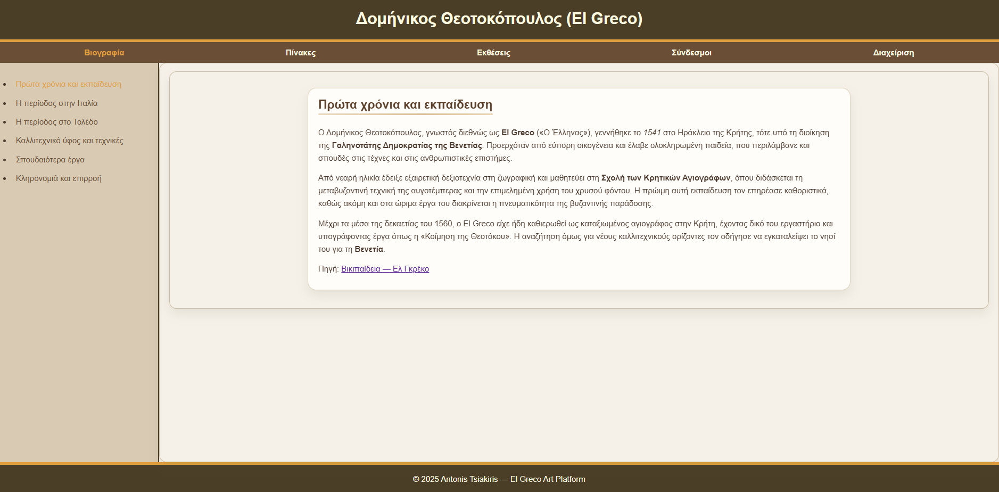
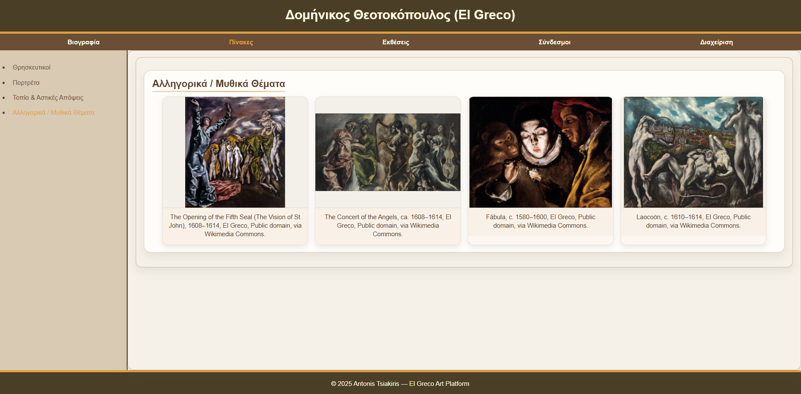
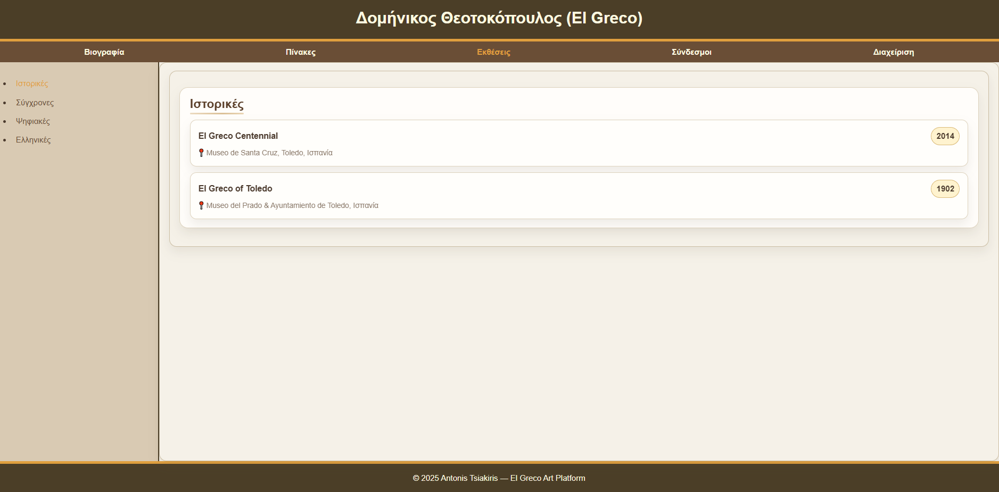
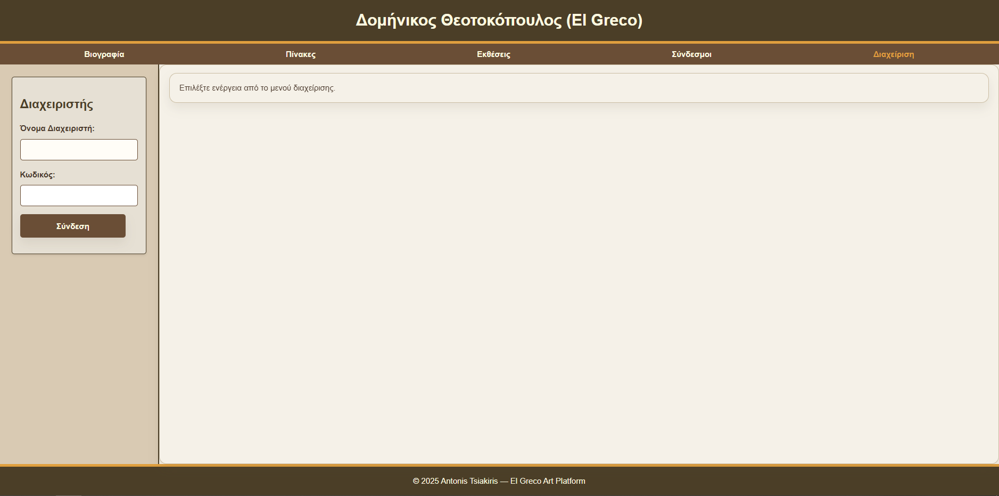
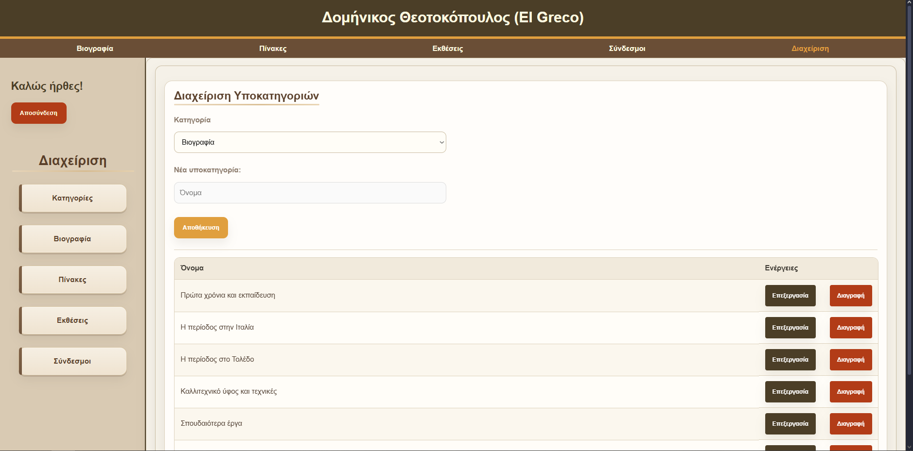
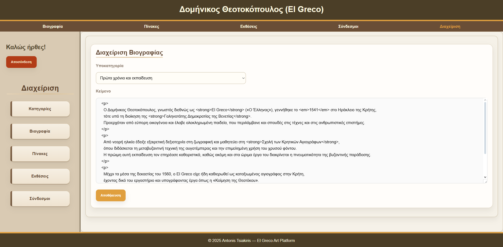
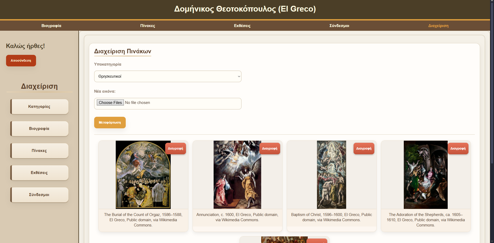
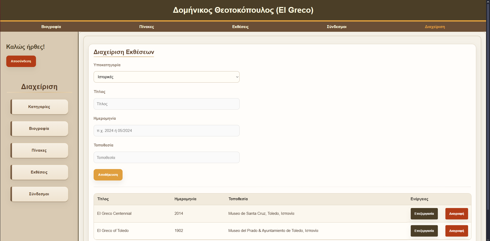
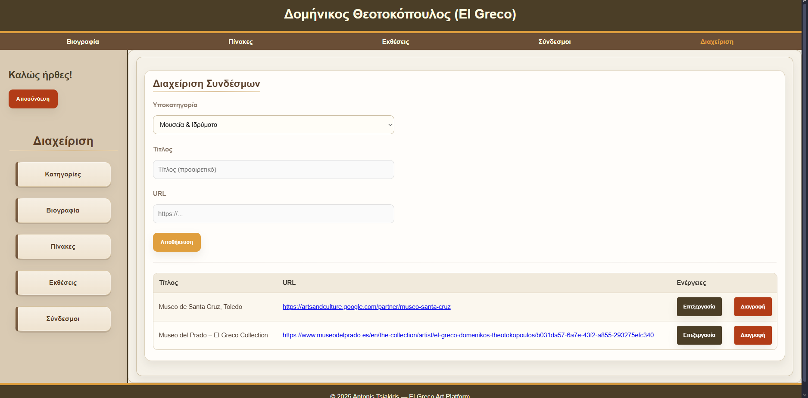

# El Greco Art Platform v2 — Full-Stack Interactive Art Experience with Secure Admin & Modern UI

<p align="center">
  <a href="https://github.com/AntonisXT/el-greco-art-platform/releases">
    
  </a>
  
  
  
  
  
  
</p>

<p align="center">
  
</p>

> A full-stack interactive art platform dedicated to *Doménikos Theotokópoulos (El Greco)* — combining visitor exploration and secure admin management.  
> Built with Node.js, Express, MongoDB, and Vanilla JS, featuring role-based authentication, dynamic content rendering, and a clean, responsive UI (v2).

---

## 🌐 Live Deployment

- **Frontend (Vercel):** [el-greco-art-platform.vercel.app](https://el-greco-art-platform.vercel.app)
- **Backend (Render):** [el-greco-art-platform.onrender.com](https://el-greco-art-platform.onrender.com)
- **API Docs (Swagger):** [el-greco-art-platform.vercel.app/api/docs](https://el-greco-art-platform.vercel.app/api/docs)

---

## 🚀 Overview

Version **2.0** introduces a full redesign and refactor — with modular architecture, improved security, and a modern frontend experience.  
The platform serves both **visitors**, who explore El Greco’s works and biography, and **administrators**, who manage and update all site content.

---

## ✨ Key Features

### 👤 Administrator Management
- Dedicated admin dashboard  
- Full CRUD management for:
  - **Paintings**, **Exhibitions**, **Biography**, **Categories/Subcategories**, and **Links**
- Role-based access control (RBAC)
- JWT authentication (HttpOnly cookies)
- Instant validation, feedback, and success/error notifications

---

### 🔒 Security & Architecture
- **Authentication & Access**
  - JWT (HttpOnly) authentication  
  - Role-based access control (RBAC)
- **Security Middleware**
  - Helmet security headers (CSP)  
  - Rate limiting for authentication endpoints  
  - CSRF protection (double submit cookie)  
  - Input sanitization using `sanitize-html`
- **Validation & Error Handling**
  - Centralized schema validation with Joi  
  - Unified and structured API responses
- **Architecture**
  - Modular backend structure under `/server/`  
  - Clear separation between routes, models, and controllers  
  - Configurable environment system (`.env`)

---

### 🎨 Frontend & UI/UX
- Pure **Vanilla JS** with ES Modules (no frameworks)  
- Responsive grid layout and minimalist design  
- Fetch-based dynamic rendering  
- Fully deployed on **Vercel** with API proxy integration

---

### 🖼️ Public Navigation & User Experience
The public-facing interface enables visitors to **explore El Greco’s works, exhibitions, and biography** through a structured and interactive layout.

- **Main Menu Navigation:**  
  The top menu includes core sections — *Biography*, *Paintings*, *Exhibitions*, and *Links*.  
  Each selection dynamically fetches content from the backend API without reloading the page.

- **Sidebar Subcategories:**  
  Each main category includes a sidebar with **subcategories**, allowing visitors to filter and navigate artworks by theme, location, or time period.

- **Dynamic Content Loading:**  
  The interface adapts instantly based on the chosen subcategory, maintaining an immersive, gallery-like browsing experience.

This design provides a smooth and elegant user experience, bridging functionality with artistic presentation.

---

### 🧩 Tech Stack

| Layer | Technology |
|-------|-------------|
| **Frontend** | HTML5, CSS3, Vanilla JS (ES Modules) |
| **Backend** | Node.js, Express.js |
| **Database** | MongoDB (Mongoose) |
| **Security** | Helmet, CSRF, sanitize-html, JWT, Rate Limiting |
| **Testing** | Jest, Supertest |
| **Documentation** | OpenAPI 3.0 + Swagger UI |
| **CI/CD** | GitHub Actions + Vercel Deploy |

---

## 🧱 File Structure

```
el-greco-art-platform/
│
├─ backend/
│   ├─ server.js
│   ├─ models/
│   ├─ routes/
│   ├─ controllers/
│   ├─ middleware/
│   └─ scripts/
│
├─ frontend/
│   ├─ index.html
│   ├─ js/
│   ├─ css/
│   └─ assets/
│
├─ docs/
│   ├─ openapi.yaml
│   ├─ demo.gif
│   └─ screenshots/
│
├─ .env.example
├─ package.json
└─ README.md
```

---

## 📦 Local Setup

### 1. Clone & Install
```bash
git clone https://github.com/AntonisXT/el-greco-art-platform.git
cd el-greco-art-platform/backend
npm install
```

### 2. Configure Environment
```bash
cp .env.example .env
# Add values for MONGO_URI, JWT_SECRET, FRONTEND_ORIGIN, etc.
```

### 3. Seed Admin User
```bash
node scripts/seed-admin.js <username> <password>
```

### 4. Run Backend
```bash
npm run dev
```

### 5. Serve Frontend (optional)
```bash
npx serve ../frontend
```

---

## 🧠 API Documentation

Full OpenAPI specification is available under:
- [`docs/openapi.yaml`](docs/openapi.yaml)
- [Swagger UI → API Docs](https://el-greco-art-platform.vercel.app/api/docs)

---

## 📸 Screenshots

### 🏛️ Public View
| Biography | Paintings | Exhibitions |
|------------|------------|-------------|
|  |  |  |

### ⚙️ Admin Panel
| Dashboard | Manage Subcategories | Edit Biography |
|------------|----------------------|----------------|
|  |  |  |

| Manage Paintings | Manage Exhibitions | Manage Links |
|------------------|--------------------|---------------|
|  |  |  |

---

## 🧭 Versions

| Version | Highlights |
|----------|-------------|
| **v1.0** | LocalStorage-based admin, CRUD only for exhibitions & links, minimal UI |
| **v2.0 (current)** | Major refactor with modular backend, role-based authentication, expanded data models, complete admin dashboard, enhanced security layers, and redesigned responsive UI/UX |

> 🏷️ [View Release Notes → v2.0.0](https://github.com/AntonisXT/el-greco-art-platform/releases/tag/v2.0.0)

---

## 📈 Roadmap

- [ ] 🌍 Add bilingual support (Greek / English)  
- [ ] ☁️ Migrate image storage to cloud (AWS S3 / Supabase)  
- [ ] 🧠 Integrate AI-based artwork recognition & classification  
- [ ] 📱 Refine responsive layout for mobile and tablet  
- [ ] 🔔 Implement real-time admin notifications (WebSocket)  
- [ ] 🧪 Expand Jest test coverage (unit & integration)  
- [ ] 💡 Add system health monitoring endpoint (`/healthz`)  
- [ ] 🌙 Introduce dark mode toggle  

---

## 📜 License
MIT License © 2025 [AntonisXT](https://github.com/AntonisXT)

---

<p align="center">Built with ❤️ by <a href="https://github.com/AntonisXT">AntonisXT</a></p>
